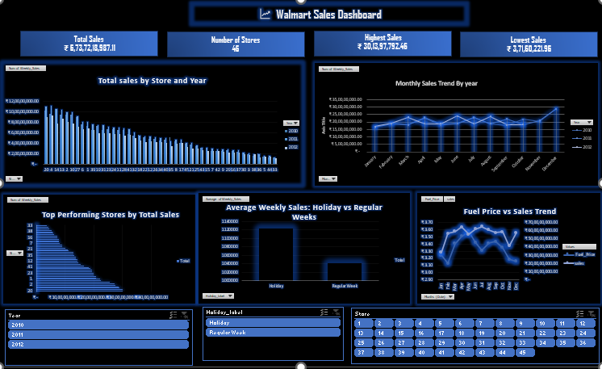

# Walmart Sales Analysis (Excel Dashboard Project)

This project analyzes sales data from Walmart across different branches and product lines using Microsoft Excel. It extracts insights using pivot tables, charts, and dashboards.

## 🔧 Tools Used
- Microsoft Excel 2021
- Pivot Tables
- Charts (Bar, Line etc)
- Slicers & Timelines
- Conditional Formatting
- Advanced Formulas

## 📊 Dashboard Preview

## 📈 Key Insights

- 🏪 **Store 20** generated the highest total sales over the 3-year period (₹301.4 million)
- 📆 **April** consistently saw the highest monthly sales across all years
- 🎉 **Holiday weeks** resulted in higher average sales compared to regular weeks (₹1.12M vs ₹1.04M)
- ⛽ Sales remained strong despite rising fuel prices, showing demand resilience
- 📊 Data included CPI, unemployment, and temperature, which can influence customer behavior

## 📂 Dataset
Original Dataset: [Kaggle - Walmart Sales](https://www.kaggle.com/datasets/yasserh/walmart-dataset)

## 👨‍💻 Skills Demonstrated
- Excel Data Cleaning
- Business KPIs Creation
- Dashboard Design
- Insightful Data Storytelling
